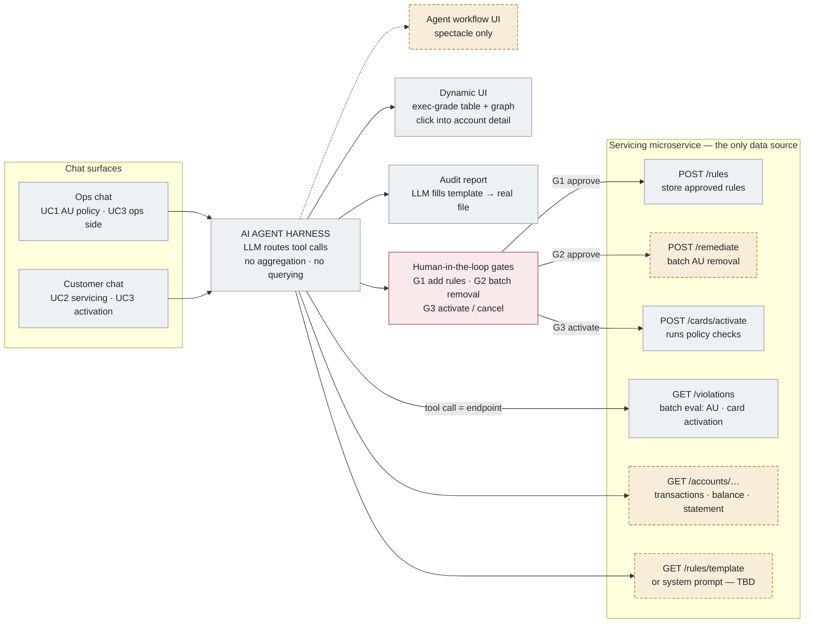

# Demo thesis — policy enforcement + servicing chat

**This document is the bare essence of the demo. If a piece of work doesn't serve one of the three
use cases below, it's fluff and we don't build it.** The Cardinal prototype is raw material — reuse
whatever accelerates us, but the existing Sentinel scripted stage is *not* the working version of
this demo.

- **Demo dates:** Tuesday **Aug 4** and Wednesday **Aug 5, 2026**
- **Working days left:** Friday Jul 31 and Monday Aug 3 (written Thursday Jul 30)
- **Audience:** high-level executives up to C-suite. **UI and wow factor take priority over practicality.**
- **Staffing:** pull in external partners wherever needed — the endpoint checklist below is the
  lay of the land for who builds what.

## Ground rules

1. **The LLM is a router.** It does no manual aggregation and no querying. Every piece of data
   comes from a GET/POST call to the servicing microservice. Tool call = endpoint.
2. **Human-in-the-loop on every consequential action.** Three gates: adding rules, batch
   remediation, card activation.
3. **Mocks are fine where noted.** The story is what matters; the seams are real, the backends
   behind some of them are not (yet).
4. Everything runs through a **chat interface**. The AI-agent workflow UI may appear on the side
   as spectacle only — nothing functional depends on it.

---

## Use case 1 — Authorized-user policy (ops chat)

The original demo. All in the chat interface.

1. **Upload.** User uploads the authorized-user policy document.
2. **Parse → propose rules.** The agent scans and parses the doc, identifies candidate rules using
   its backend knowledge of the rule format (rule template via a GET endpoint, or baked into the
   system prompt — TBD), and asks: *"Can I add these rules?"*
3. **Gate 1 — approve rules.** Human approves. Agent calls **POST** to store the rules in the
   servicing microservice.
4. **Query violations.** User prompts: *"Give me the accounts that fail on these authorized-user
   policies."* Agent calls **GET** (batch evaluation) and the UI renders the results dynamically —
   a table, a graph, or both. Exec-grade polish.
5. **Drill-down.** User clicks into the table and sees individual account-level detail: which
   account, which policy it failed.
6. **Unprompted recommendation.** Looking at the aggregate output, the agent proactively
   recommends an action based on the results and the policy it understands — e.g. *authorized
   users cannot be on a secured credit card → recommend batch removal of those authorized users.*
7. **Gate 2 — approve batch removal.** Approve/reject tool prompt. User approves; the batch
   removal kicks off. **The actual removal is mocked** — "kicked off in batch" is enough.
8. **Audit report.** The agent generates a real output file — what happened, an audit trail — in
   a nice template format.

**The business point:** today, removing one authorized user takes ~10 minutes per account — before
counting login and context switching. One click, the AI identifies and recommends, a human always
approves. The time savings in aggregate is the story.

## Use case 2 — Customer-facing servicing chatbot

Basic Q&A, customer-scoped:

- "What are my latest transactions?"
- "What is my balance?"
- "What is my next statement?"

**Data is mocked for now** — we don't know yet whether we have it. Wire the seams, fake the values.

## Use case 3 — Card-activation policy (new requirement)

Same practice as use case 1, on both sides of the house:

**Ops side (chat):**
- Card-activation rules get set (same upload → parse → approve → POST flow).
- An endpoint executes the rules **in batch against the event logs** in the backend.
- Agent returns the out-of-compliance card-activation accounts from that **GET** call.
- Human-in-the-loop takes some action on the result (same shape as use case 1's gate 2).

**Customer side (chatbot):**
- Customer: *"I just got my card, I'm here to activate it."*
- Agent presents an **Activate / Cancel** prompt (gate 3).
- On Activate, the request runs through all the policies:
  - **Fail path:** "This account is failing a policy" — even though the card arrived.
  - **Happy path:** "Your card is activated."

---

## Endpoint checklist (the lay of the land)

Names are illustrative — final names TBD with the servicing team. The **seam** is what's fixed:
one tool call per row, all data server-side.

| # | Agent tool call | Endpoint (servicing microservice) | Verb | Use case | Status |
|---|---|---|---|---|---|
| 1 | Save approved rules | `/rules` | POST | UC1, UC3 | build |
| 2 | Fetch rule template | `/rules/template` — or bake into system prompt | GET | UC1, UC3 | TBD |
| 3 | Batch AU policy evaluation | `/violations?policy=authorized-user` | GET | UC1 | build |
| 4 | Batch card-activation evaluation (against event logs) | `/violations?policy=card-activation` | GET | UC3 | build |
| 5 | Account drill-down detail | in the eval payload, or `/accounts/{id}/violations` | GET | UC1 | build |
| 6 | Transactions / balance / next statement | `/accounts/{id}/…` | GET | UC2 | **mock** |
| 7 | Card activation (runs policy checks) | `/cards/activate` | POST | UC3 | build (check real, activation mock) |
| 8 | Batch AU removal | `/remediate` | POST | UC1 | **mock** — reply "kicked off in batch" |
| 9 | Audit report file | LLM fills a fixed template → real file | — | UC1 | build |

Plus three human-in-the-loop gates (not endpoints — native tool-approval in the harness):
**G1** add rules · **G2** batch removal · **G3** activate/cancel.

## High-level diagram

Legend: **grey** = build for real · **cardinal** = human-in-the-loop gates · **amber dashed** =
mocked or TBD for this demo.

## Explicitly out of scope

- The Sentinel three-act scripted stage as the demo vehicle (chat is the vehicle now).
- Everything in Cardinal not named above: party graph, balance-transfer machinery, portfolio
  exec surfaces, and any other prototype scaffolding. Don't delete — just don't build on it
  for Tuesday.
